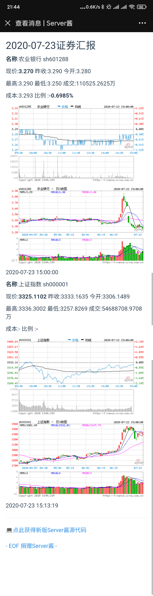

# postdog

一个自用的微信通知工具，每个交易日收盘后通过微信通知相关信息。

核心是[https://sc.ftqq.com/](https://sc.ftqq.com/)提供的微信推送API和新浪财经的数据API。

并借此机会学习一下docker的基本操作。

## DOCKER

使用docker进行管理部署

### 使用方法

```bash
git pull https://github.com/ybw2016v/postdog.git
```

到dockerhub拉取镜像

```
docker pull dogcraft/postdog
```

更改配置文件`list.conf`

``` text
sh601288 3.293
sh600223
sh000001

```

在`dog_info.py`里面填写用于推送微信的密钥。
```python
SKEY=''#应该在第15行
```

每行一个股票代码，后面可以加上成本价后可自动计算浮动盈亏，不加则不计算。

所使用的股票代码应当符合新浪财经API的规范。

所有都安排完毕之后就是设置定时运行

``` bash

crontab -e
```

进入编辑模式之后，可以设置收盘之后开始推送消息。

``` bash
15 15 * * * docker container run --volume "/path/to/postdog":/app dogcraft/postdog python dog_info.py

```

### 效果展示




#### 新浪财经api

新浪财经提供下面的api

具体使用方法以及注意事项可以看下面这两个链接：

[链接1](https://segmentfault.com/a/1190000016294620) [链接2](https://www.jianshu.com/p/108b8110a98c)

行情接口

[https://hq.sinajs.cn/list=sz002307,sh600223](https://hq.sinajs.cn/list=sz002307,sh600223)

分时图接口

[https://image.sinajs.cn/newchart/min/n/sh000001.png]( https://image.sinajs.cn/newchart/min/n/sh000001.png)


日K图接口

[https://image.sinajs.cn/newchart/daily/n/sh000001.png]( https://image.sinajs.cn/newchart/min/daily/sh000001.png)

